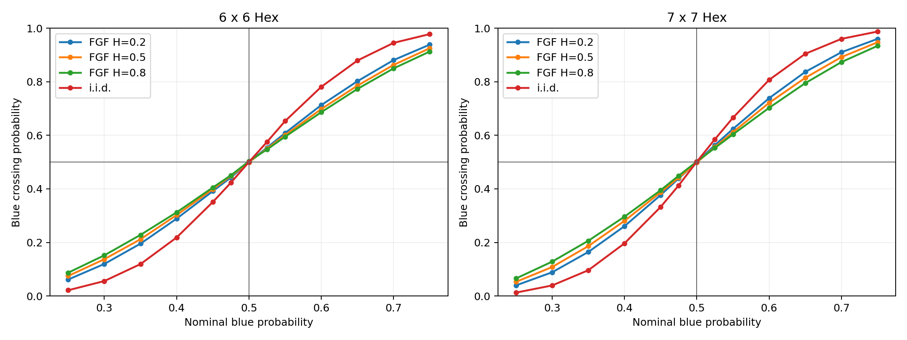

# Correlated-Field Hex CUDA Report

## Experiment

Thresholded `6 x 6` and `7 x 7` Hex boards were generated from either
independent uniforms or periodic cutoff fractional-Gaussian surfaces. Each
curve uses **200,000** samples per nominal probability and seed
`20260731`.

| family | H | size | crossing at 1/2 | realized blue | neighbor agreement | p75-p25 |
| --- | ---: | ---: | ---: | ---: | ---: | ---: |
| fractional_gaussian | 0.2 | 6 | 0.5004 | 0.5000 | 0.6562 | 0.2416 |
| fractional_gaussian | 0.2 | 7 | 0.4992 | 0.5000 | 0.6557 | 0.2113 |
| fractional_gaussian | 0.5 | 6 | 0.4994 | 0.5001 | 0.6948 | 0.2586 |
| fractional_gaussian | 0.5 | 7 | 0.4980 | 0.4998 | 0.6941 | 0.2315 |
| fractional_gaussian | 0.8 | 6 | 0.5032 | 0.5003 | 0.7256 | 0.2737 |
| fractional_gaussian | 0.8 | 7 | 0.5021 | 0.5002 | 0.7250 | 0.2513 |
| iid |  | 6 | 0.5004 | 0.5002 | 0.4997 | 0.1759 |
| iid |  | 7 | 0.5013 | 0.5002 | 0.4999 | 0.1601 |

## Reading the comparison

Neighbor agreement measures the local clustering introduced by the field.
The crossing curve measures its global consequence. Comparing transition
widths at fixed board size separates a density effect from a correlation
effect: a family can have realized blue fraction near one half while having
a substantially different crossing response away from one half.

## Boundaries

- These are finite periodic cutoff Gaussian fields at resolution eight, not
  continuum fractional Gaussian fields.
- Per-surface centering and variance normalization alter finite-sample
  marginal tails; the realized blue fraction is therefore reported.
- Correlated samples do not inherit Russo's independent-site pivotal
  identity.
- The Hex winner theorem remains exact for every completed board, but the
  sampled probability curves are empirical.
- This experiment diagnoses planar threshold slices; it does not preserve or
  certify three-dimensional knot type.
