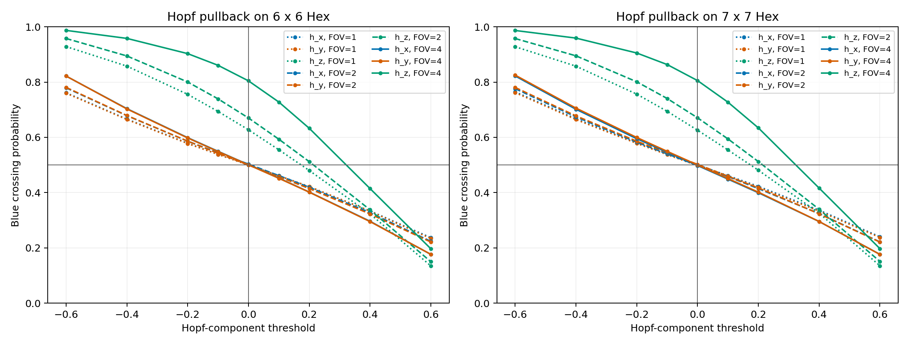

# Hopf-to-Hex CUDA Slice Report

## Experiment

The classical Hopf map is evaluated on Bateman `S^3` coordinates over
randomly centered and oriented planar Hex windows. Each component
`h_x, h_y, h_z` is thresholded into a completed two-color board. The full
run uses **100,000** windows per size/FOV configuration.

| size | FOV | channel | blue fraction at 0 | neighbor agreement | crossing at 0 | threshold width |
| ---: | ---: | --- | ---: | ---: | ---: | ---: |
| 6 | 1.0 | h_x | 0.4999 | 0.9759 | 0.4997 | 1.1492 |
| 6 | 1.0 | h_y | 0.4997 | 0.9759 | 0.4998 | 1.1467 |
| 6 | 1.0 | h_z | 0.6170 | 0.9645 | 0.6275 | 0.6683 |
| 6 | 2.0 | h_x | 0.5036 | 0.9520 | 0.5032 | 1.0908 |
| 6 | 2.0 | h_y | 0.5003 | 0.9520 | 0.4997 | 1.0825 |
| 6 | 2.0 | h_z | 0.6342 | 0.9296 | 0.6701 | 0.6108 |
| 6 | 4.0 | h_x | 0.5007 | 0.9078 | 0.5010 | 0.9553 |
| 6 | 4.0 | h_y | 0.4996 | 0.9077 | 0.5006 | 0.9552 |
| 6 | 4.0 | h_z | 0.6822 | 0.8720 | 0.8045 | 0.4800 |
| 7 | 1.0 | h_x | 0.5005 | 0.9800 | 0.5003 | 1.1490 |
| 7 | 1.0 | h_y | 0.4982 | 0.9799 | 0.4976 | 1.1493 |
| 7 | 1.0 | h_z | 0.6180 | 0.9703 | 0.6260 | 0.6690 |
| 7 | 2.0 | h_x | 0.4990 | 0.9602 | 0.4984 | 1.0932 |
| 7 | 2.0 | h_y | 0.5011 | 0.9599 | 0.5022 | 1.0835 |
| 7 | 2.0 | h_z | 0.6341 | 0.9413 | 0.6707 | 0.6102 |
| 7 | 4.0 | h_x | 0.4987 | 0.9230 | 0.4980 | 0.9565 |
| 7 | 4.0 | h_y | 0.5007 | 0.9228 | 0.5000 | 0.9501 |
| 7 | 4.0 | h_z | 0.6799 | 0.8927 | 0.8055 | 0.4807 |

## Gauge audit

Every `S^3` coordinate pair was also multiplied by a random common `U(1)`
phase before applying the Hopf map.

- Maximum Hopf-map phase residual: **1.332e-15**.
- Thresholded-board mismatches: **0**.
- Both/neither Hex winners: **0**.

Thus the planar observable depends on the projective Hopf point, not the
arbitrary fiber-phase representative.

## Interpretation

The transition width and neighbor agreement measure how the pulled-back Hopf
texture alters global planar connectivity. Differences among components or
fields of view are geometric finite-window effects. They are not evidence
that Hex detects a three-dimensional knot.

## Surrogate-model decision

No learned surrogate is fitted. The Hopf map and Hex winner test are evaluated
directly, and the remaining threshold response is one-dimensional and
monotone. Following the compute-matched cautions in the KAN critical
assessment (arXiv:2407.11075), a KAN would enter only a later
symbolic-regression comparison against simpler spline, logistic, and matched
MLP baselines. Predictive fit would remain conjecture-generating evidence, not
a topology proof.

## Boundaries

- This experiment uses only the classical Hopf bundle and the existing exact
  Bateman coordinate formulas.
- It does not import the TUFT manuscript's gauge-gravity or particle claims.
- Random planar slices discard three-dimensional information and cannot
  certify linking, helicity, or knot type.
- The curves are finite Monte Carlo measurements, not new Hex theorems.
