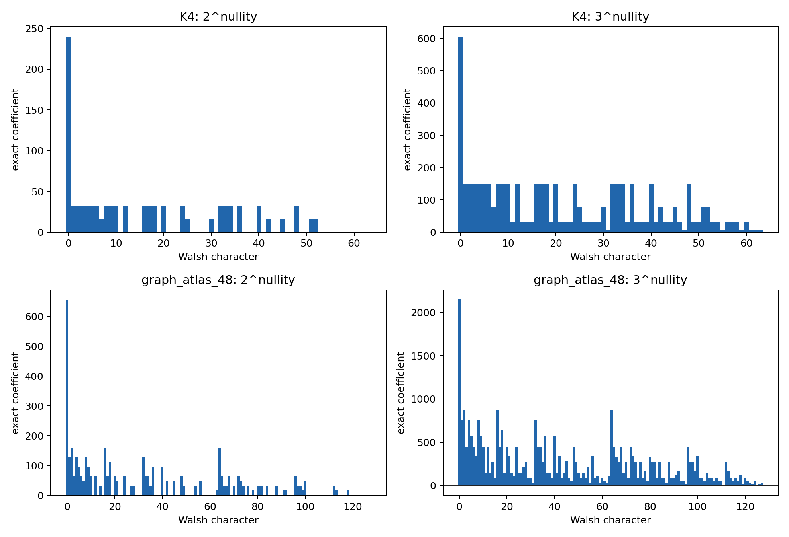
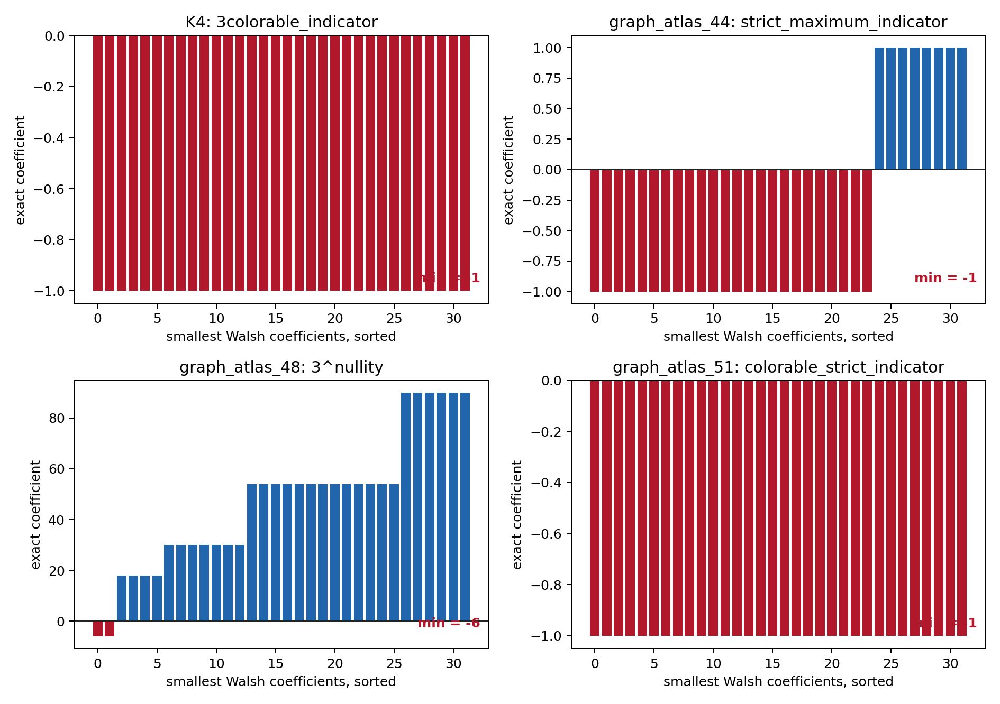

# Picture-Fourier Smoothing Report

## Diagram-derived operation

Following the Jaffe-Liu quarter-turn diagram, the Boolean smoothing cube is
treated as `Z_2^E`. Its exact Walsh transform interchanges XOR convolution and
pointwise multiplication. Translation-kernel positivity is then equivalent
to a nonnegative Walsh spectrum.

## Exact proposition

For every graph and every nonnegative integer `r`,
`2^(r nullity(L_s))` is positive definite on the smoothing cube. It counts
tuples of mod-2 Laplacian kernel vectors and is a sum of indicators of linear
subspaces. Each such indicator has nonnegative Walsh transform.

## Bounded atlas census

| observable | planar graphs | PSD | indefinite | first indefinite atlas index |
| --- | ---: | ---: | ---: | ---: |
| 2^nullity | 470 | 470 | 0 |  |
| 3^nullity | 470 | 373 | 97 | 48 |
| strict_maximum_indicator | 470 | 331 | 139 | 44 |

## Selected fixtures

| fixture | observable | spectrum minimum | negative coefficients | PSD |
| --- | --- | ---: | ---: | --- |
| K4 | 2^nullity | 0 | 0 | True |
| K4 | 3^nullity | 6 | 0 | True |
| K4 | strict_maximum_indicator | 0 | 0 | True |
| K4 | 3colorable_indicator | -1 | 32 | False |
| K4 | colorable_strict_indicator | -1 | 32 | False |
| graph_atlas_44 | 2^nullity | 0 | 0 | True |
| graph_atlas_44 | 3^nullity | 24 | 0 | True |
| graph_atlas_44 | strict_maximum_indicator | -1 | 24 | False |
| graph_atlas_48 | 2^nullity | 0 | 0 | True |
| graph_atlas_48 | 3^nullity | -6 | 2 | False |
| graph_atlas_48 | strict_maximum_indicator | -2 | 16 | False |
| graph_atlas_51 | 2^nullity | 0 | 0 | True |
| graph_atlas_51 | 3^nullity | -30 | 24 | False |
| graph_atlas_51 | strict_maximum_indicator | 0 | 0 | True |
| graph_atlas_51 | 3colorable_indicator | -1 | 256 | False |
| graph_atlas_51 | colorable_strict_indicator | -1 | 256 | False |

The signed controls make the small negative coefficients visible:

## Game interpretation

Giving every edge-player the common payoff `nullity(L_s)` makes strict Nash
equilibria exactly the strict local maxima of the smoothing landscape. This is
an identical-interest potential game, not a Prisoner's Dilemma. Some such
equilibria are not 3-colorable, so equilibrium under the surrogate objective
does not solve the global coloring problem.

## Boundary

The positive nullity kernel does not imply positivity of `3^nullity`, the
strict-maximum indicator, or the 3-colorable-state indicator. The census and
fixtures are exact finite diagnostics. No Four Color proof or literature
novelty claim is made.
