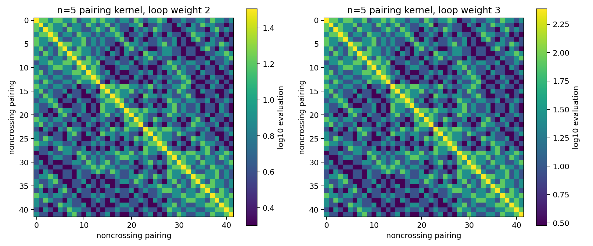

# Jaffe-Liu Picture-Language Reflection Gate

## Exact pairing kernel

For each noncrossing pairing `P` of `2n` boundary points, assign the indicator
vector of all `d`-color boundary assignments constant on the pairs of `P`.
The exact inner product of two such vectors is

```text
G(P,Q) = d ^ loops(P glued to Q).
```

This is a constructive Gram factorization, not merely a numerical PSD test.

| pairs | Catalan dimension | loop weight | rank | min eigenvalue | exact feature factorization |
| ---: | ---: | ---: | ---: | ---: | --- |
| 1 | 1 | 2 | 1 | 2 | True |
| 1 | 1 | 3 | 1 | 3 | True |
| 2 | 2 | 2 | 2 | 2 | True |
| 2 | 2 | 3 | 2 | 6 | True |
| 3 | 5 | 2 | 5 | 1.15114 | True |
| 3 | 5 | 3 | 5 | 9.40362 | True |
| 4 | 14 | 2 | 14 | 0.418263 | True |
| 4 | 14 | 3 | 14 | 12.5848 | True |
| 5 | 42 | 2 | 42 | 0.103029 | True |
| 5 | 42 | 3 | 42 | 15.1257 | True |



## Penrose half-pictures

The boundary vector of each half-picture is obtained by exactly contracting
all internal colors of the signed three-color Levi-Civita tensor.

| fixture | evaluation | norm square | role |
| --- | ---: | --- | --- |
| tripod_reflection_double | 6 | True | positive reflected double |
| reversed_tripod_reflection_double | 6 | True | positive reflected double |
| tripod_mixed_orientation | -6 | False | mixed-gluing obstruction |
| two_vertex_channel_reflection_double | 12 | True | positive reflected double |

A reflected double is `sum_c A(c)^2` and is nonnegative. The orientation-
reversed tripod has boundary vector `-A`, so its mixed gluing with the original
tripod is `-6`. Thus arbitrary gluing is not itself a positive quantity.

## Consequence for the Four Color program

The picture-language formalism supplies a precise target: rewrite a useful
smoothing reduction or diagram evaluation as a reflected double, or as a sum
of such doubles, while preserving the colorable-state existence predicate.
The present fixtures prove positivity only for the declared kernels. They do
not show that a general Penrose contraction has this form and do not establish
a new Four Color theorem.

## Audit

- Reflection is involutive on every enumerated pairing.
- Every loop kernel equals its explicit color-feature Gram matrix.
- Every reflected Penrose fixture is nonnegative.
- A negative mixed-gluing control is retained.
- No literature-novelty or Four Color proof claim is made.
